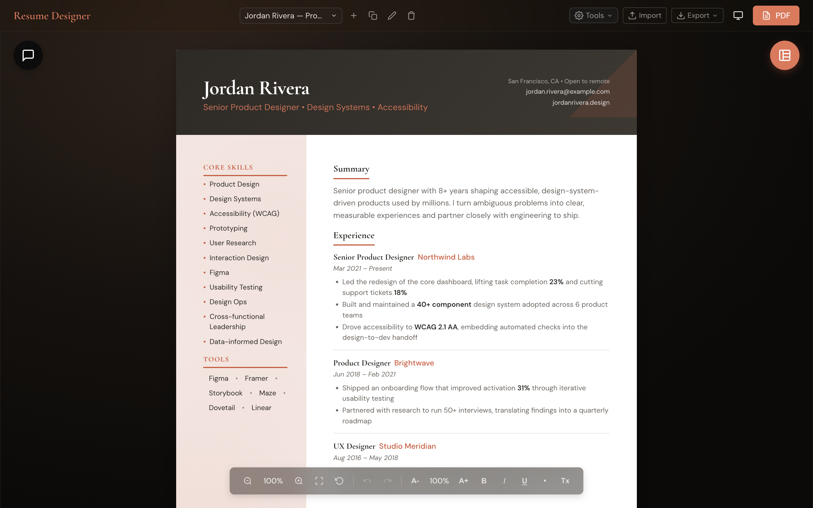

<div align="center">

# Resume Designer

**An AI-assisted résumé builder that turns one master profile into polished, job-tailored résumés — privately, on your own machine.**

[](LICENSE)
[](https://github.com/SiriusA7/Resume-Designer/releases/latest)
[](#download)
[](https://v2.tauri.app/)



</div>

## What it is

Resume Designer is a desktop app (and browser app) for building résumés. You keep **one master profile** — your full work history, skills, education, and projects — and spin off as many **tailored variants** as you need, each pointed at a specific role. An optional AI assistant (powered by your own [OpenRouter](https://openrouter.ai) key) helps you draft, rewrite, and tailor content to a job description, and every AI edit is shown as an inline diff you approve or reject.

Your résumé data never leaves your machine except for the AI calls you explicitly make — there's no account, no backend, and no telemetry.

## Features

**Build**
- One **master profile** → many **tailored résumé variants**.
- **11 layouts** — Sidebar, Stacked, Stacked Vertical, Right Sidebar, Compact, Executive, Classic, Classic Featured, Modern, Timeline, and Creative.
- Click-to-edit **inline editing**, drag-to-reorder sections, add/remove/restructure from a structure panel.
- **Version history** so you can step back through changes, plus zoom and live text-formatting tools.

**AI assistant (bring your own key)**
- One [OpenRouter](https://openrouter.ai) key → many models (Claude, GPT, Gemini, and more), with a model picker and per-model reasoning-effort control.
- **Tailor to a job description**: paste a posting and let the assistant rewrite your résumé for it — applied as **inline diffs you review** before they land.
- A chat panel for free-form drafting/feedback, with **token-usage and cost tracking**.

**Import & export**
- **Import an existing résumé** from PDF or Word (`.docx`) to bootstrap your profile.
- **Export to PDF** (native, high-fidelity capture on the desktop app).
- **Back up and restore** all your data as a JSON file.

**Make it yours**
- Color palettes + a custom accent color, font choices, and spacing/typography controls.
- Optional profile photo.
- Light / dark themes, plus a translucent **"liquid glass"** treatment on the desktop app.

**Desktop**
- Native macOS and Windows builds with **automatic updates**.

## Download

Grab the latest installer from the [**Releases page**](https://github.com/SiriusA7/Resume-Designer/releases/latest):

| Platform | File | Notes |
| --- | --- | --- |
| macOS (Apple Silicon) | `Resume Designer_<version>_aarch64.dmg` | Signed & notarized |
| macOS (Intel) | `Resume Designer_<version>_x64.dmg` | Signed & notarized |
| Windows | `Resume Designer_<version>_x64-setup.exe` | Currently unsigned — see note below |

The app updates itself: when a new release is published, it prompts you to download and restart.

**System requirements:** macOS 12.3 (Monterey) or later · Windows 10 (1809) or later.

> **Windows note:** the installer is not yet code-signed, so Windows SmartScreen may warn on first launch. Choose **More info → Run anyway** to proceed.

Prefer not to install anything? You can also run it in a browser — see [Run from source](#run-from-source).

## Using the AI features

The AI features are optional and **use your own [OpenRouter](https://openrouter.ai) API key**:

1. Create a free OpenRouter account and generate an API key.
2. Paste it into Resume Designer when prompted (or in Settings).
3. Pick a model and start chatting or tailoring.

Your key is stored locally on your device and is sent only to OpenRouter to make the AI requests you trigger. You only pay OpenRouter for what you use; everything else in the app works without a key.

## Privacy & data

- **Local-first:** résumés, profile, and settings live in your browser/app local storage on your device.
- **No account, no backend, no analytics.** Network use is limited to: the AI requests you make to OpenRouter, the desktop app's update check (GitHub Releases), and **web fonts** — the default typography preset loads fonts from Google Fonts (`fonts.googleapis.com` / `fonts.gstatic.com`). Pick a system-font pairing in Settings to keep the app fully offline.
- Export a full **JSON backup** any time, and import it on another machine.

## Run from source

The app is a vanilla-JS + [Vite](https://vitejs.dev/) front end wrapped in a [Tauri 2](https://v2.tauri.app/) desktop shell. All commands run from the `resume-designer/` directory.

```bash
git clone https://github.com/SiriusA7/Resume-Designer.git
cd Resume-Designer/resume-designer
npm install

# Run in the browser (no desktop shell) at http://localhost:3000
npm run dev

# Run the native desktop app with hot reload (requires the Rust toolchain)
npm run tauri:dev
```

### Build

```bash
# Browser bundle
npm run build

# Native desktop app for the current platform
npm run tauri:build
```

**Prerequisites for the desktop build:** Node.js 20+, the [Rust toolchain](https://rustup.rs/), and platform build tools (Xcode Command Line Tools on macOS; Visual Studio C++ Build Tools + Windows SDK on Windows). The first Tauri build compiles Rust and takes a few minutes; later builds are cached.

Full build, signing, notarization, and release details are in [`resume-designer/TAURI.md`](resume-designer/TAURI.md).

## Tech stack

- **Front end:** vanilla JavaScript (no UI framework) + Vite 5, with a small reactive store.
- **Desktop shell:** Tauri 2 (Rust) — native dialogs, file system, auto-updater, and a WKWebView/WebView2-based PDF capture.
- **AI:** [OpenRouter](https://openrouter.ai) HTTP API (bring your own key).
- **Notable libraries:** `pdfjs-dist` + `mammoth` (PDF/DOCX import), `html2pdf.js` + `html-to-image` (browser PDF export), `marked` (chat rendering), `diff` (inline AI-edit diffs).

## Contributing

Issues and pull requests are welcome. For anything substantial, please open an issue first to discuss the approach. By contributing, you agree your contributions are licensed under the project's AGPL-3.0 license.

## License

Licensed under the **GNU Affero General Public License v3.0 (AGPL-3.0)** — see [`LICENSE`](LICENSE).

In short: you're free to use, study, modify, and share this software, but any distributed or **network-hosted** modified version must also be released as open source under the AGPL. See [the license](LICENSE) for the exact terms.
