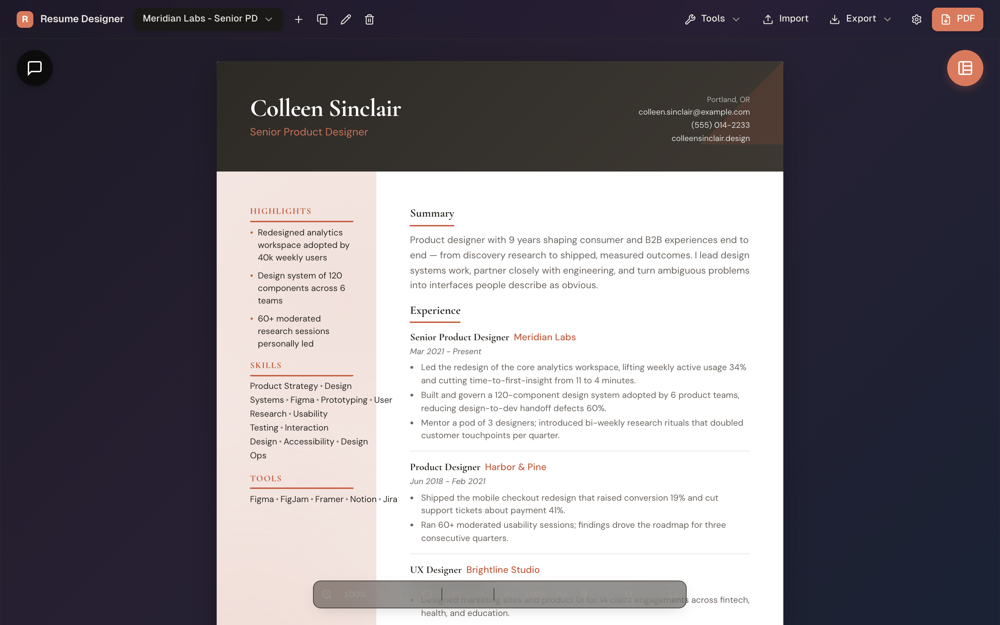

<div align="center">

# On Paper

**Your career, clearly put.**

**A private career workspace for resumes and job applications — on your own machine.**

[](https://onpaper.pro)
[](LICENSE)
[](https://github.com/ashproto/Resume-Designer/releases/latest)
[](https://github.com/ashproto/Resume-Designer/releases)
[](#download)
[](https://v2.tauri.app/)



</div>

## What it is

**On Paper, formerly Resume Designer**, is a private career workspace for resumes and job applications. You keep **one profile** — your full work history, skills, education, and projects — and shape it into a focused resume for each role you go after. An optional AI assistant (powered by your own [OpenRouter](https://openrouter.ai) key) helps you draft, rewrite, and tailor content to a job description, and every AI edit is shown as an inline diff you approve or reject.

Your resume data never leaves your machine except for the AI calls you explicitly make — there's no account, no backend, and no telemetry.

## Features

**Build**
- One **master profile** → many **tailored resume variants**.
- **11 layouts** — Sidebar, Stacked, Stacked Vertical, Right Sidebar, Compact, Executive, Classic, Classic Featured, Modern, Timeline, and Creative.
- Click-to-edit **inline editing**, drag-to-reorder sections, add/remove/restructure from a structure panel.
- **Version history** so you can step back through changes, plus zoom and live text-formatting tools.
- **Page setup** — choose page size (Letter / A4) and margins; content **paginates across multiple pages**, both on screen and in the exported PDF.

**AI assistant (bring your own key)**
- One [OpenRouter](https://openrouter.ai) key → many models (Claude, GPT, Gemini, and more), with a model picker and per-model reasoning-effort control.
- **Generate a resume for a job**: paste a posting and the assistant builds a brand-new tailored variant from your master profile.
- **Tailor an existing resume**: the assistant rewrites it for a posting — applied as **inline diffs you review** before they land.
- Responses **stream live, including the model's reasoning**, with a stop control, web-search **citations**, and per-run token/cost stats.
- A chat panel for free-form drafting/feedback with **per-resume conversation threads**, plus **token-usage and cost tracking** across every feature.

**Import & export**
- **Import an existing resume** from PDF or Word (`.docx`) to bootstrap your profile.
- **Export to PDF** — true vector, multi-page PDF with per-page sizing (native print-to-PDF on the desktop app; image-based fallback in the browser).
- **Back up and restore** all your data as a JSON file.

**Make it yours**
- Color palettes + a custom accent color, font choices, and spacing/typography controls.
- Optional profile photo.
- Light / dark themes, plus a translucent **"liquid glass"** treatment on the desktop app.

**Desktop**
- Native macOS and Windows builds with **automatic updates** — the **release changelog** is shown before and after updating, with a browsable **"What's new" history** in Settings.
- macOS **app menu** with Settings and Check for Updates.

## Download

Grab the latest installer from the [**Releases page**](https://github.com/ashproto/Resume-Designer/releases/latest):

| Platform | File | Notes |
| --- | --- | --- |
| macOS (Apple Silicon) | `On-Paper_<version>_aarch64.dmg` | Signed & notarized |
| macOS (Intel) | `On-Paper_<version>_x64.dmg` | Signed & notarized |
| Windows | `On-Paper_<version>_x64-setup.exe` | Currently unsigned — see note below |

The app updates itself: when a new release is published, it prompts you to download and restart.

**System requirements:** macOS 14.4 (Sonoma) or later · Windows 10 (1809) or later.

> **Windows note:** the installer is not yet code-signed, so Windows SmartScreen may warn on first launch. Choose **More info → Run anyway** to proceed.

Prefer not to install anything? You can also run it in a browser — see [Run from source](#run-from-source). A browser has no system keychain, so your API key is encrypted before it's stored there, under a key that can't be read out through the browser's crypto API. Note that a copy of the whole browser profile carries both the encrypted key and the key that unlocks it, so treat profile backups as containing your API key.

## Using the AI features

The AI features are optional and **use your own [OpenRouter](https://openrouter.ai) API key**:

1. Create a free OpenRouter account and generate an API key.
2. Paste it into On Paper when prompted (or in Settings).
3. Pick a model and start chatting or tailoring.

Your key is stored locally on your device and is sent only to OpenRouter to make the AI requests you trigger. You only pay OpenRouter for what you use; everything else in the app works without a key.

## Privacy & data

- **Local-first:** resumes, profile, and settings live on your device — the desktop app stores them as plain files under its application-support folder; the browser build uses browser local storage.
- **No account, no backend, no analytics.** Network use is limited to three things: the AI requests you make to OpenRouter; the desktop app's automatic update check on launch (GitHub Releases); and **web fonts for the resume document** — a Google-Fonts typography pairing loads from `fonts.googleapis.com` / `fonts.gstatic.com` only while it's the selected style. Choose a **system-font pairing** in Settings and the app makes zero font requests; its own UI fonts (Geist) are always bundled. (The desktop update check runs regardless; the browser build checks for neither updates nor telemetry.)
- Export a full **JSON backup** any time, and import it on another machine.

## Run from source

The app is a [React](https://react.dev/) + [Vite](https://vitejs.dev/) front end wrapped in a [Tauri 2](https://v2.tauri.app/) desktop shell. All commands run from the `resume-designer/` directory.

```bash
git clone https://github.com/ashproto/Resume-Designer.git
cd Resume-Designer/resume-designer
npm install

# Run in the browser (no desktop shell) at http://localhost:3000
npm run dev

# Run the native desktop app with hot reload (requires the Rust toolchain)
npm run tauri:dev
```

### Build

```bash
# Browser bundle
npm run build

# Native desktop app for the current platform
npm run tauri:build
```

**Prerequisites for the desktop build:** Node.js 22.13+ (24 recommended — it is what CI runs, and what `.nvmrc` selects), the [Rust toolchain](https://rustup.rs/), and platform build tools (Xcode Command Line Tools on macOS; Visual Studio C++ Build Tools + Windows SDK on Windows). The first Tauri build compiles Rust and takes a few minutes; later builds are cached.

Full build, signing, notarization, and release details are in [`resume-designer/TAURI.md`](resume-designer/TAURI.md).

## Tech stack

- **Front end:** [React 19](https://react.dev/) + [shadcn/ui](https://ui.shadcn.com/) (Radix + Tailwind) for the app chrome, with the resume document rendered by framework-free vanilla JS that the React shell hosts but never touches; Vite and a small reactive store underneath. Chrome typography is [Geist](https://vercel.com/font), self-hosted via `@fontsource`.
- **Desktop shell:** Tauri 2 (Rust) — native dialogs, file system, auto-updater, and a WKWebView/WebView2-based PDF capture through a hidden `print.html` window.
- **AI:** [OpenRouter](https://openrouter.ai) HTTP API (bring your own key), streamed over SSE with live reasoning, citations, and usage accounting.
- **Notable libraries:** `pdfjs-dist` + `mammoth` (PDF/DOCX import), `html2pdf.js` + `html-to-image` (browser PDF export), `marked` + `DOMPurify` (sanitized chat rendering), `diff` (inline AI-edit diffs), `@dnd-kit` (drag-to-reorder), `sonner` (toasts), `lucide-react` (icons).

## Contributing

Issues and pull requests are welcome. For anything substantial, please open an issue first to discuss the approach.

By contributing, you agree to both of the following:

- **Everyone receives your contribution under CC BY-NC-SA 4.0** — the same license as the rest of the project.
- **The project's copyright holder** (identified in [`LICENSE`](LICENSE)), **and their successors and assigns, additionally receive a perpetual, worldwide, non-exclusive, irrevocable, sublicensable license** to use, modify, and distribute your contribution under any terms, including in binaries distributed through app stores.

You keep the copyright in your work. The second grant exists for one specific reason: CC BY-NC-SA forbids applying DRM or additional terms to the licensed material, and every app store does both. Without it, a single merged contribution would make On Paper impossible to ship through the App Store. The grant is non-exclusive and takes nothing away from the first one.

## License

**Free · source-available · noncommercial** — **On Paper** is licensed under [Creative Commons Attribution-NonCommercial-ShareAlike 4.0](https://creativecommons.org/licenses/by-nc-sa/4.0/) (CC BY-NC-SA 4.0). See [`LICENSE`](LICENSE) for the full terms.

- **Use it for anything, including at work.** Creating resumes, profiles, exports, and other application materials — personal or commercial — is fine. The noncommercial term is about the app itself, not the work you produce with it.
- **Your documents are yours.** Resumes, PDFs, backups, profile data, and other outputs you create with the app are not licensed by this project license.
- **Don't commercialize the app.** No reselling, repackaging-and-selling, or offering it as a paid hosted service.
- **ShareAlike.** Distribute modified versions under these same terms.

Want a commercial arrangement this license doesn't cover? Open an issue. This is a source-available, noncommercial license — **not** an OSI-approved open-source license.
