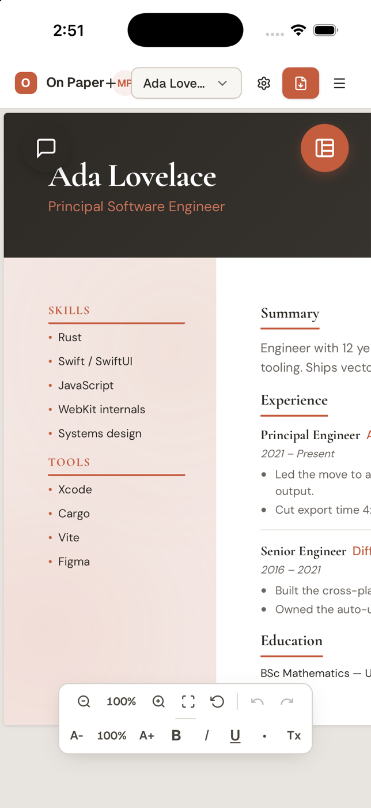
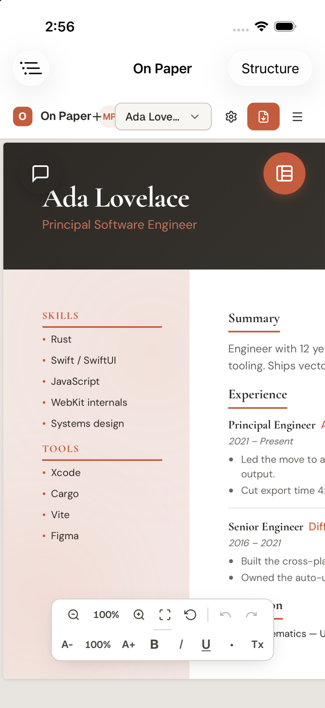
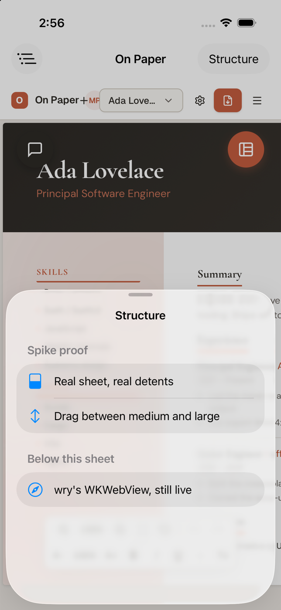
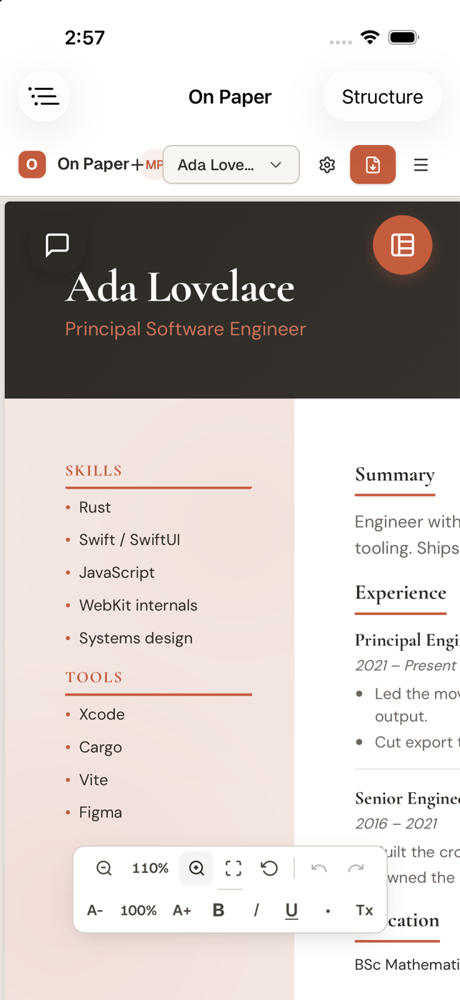
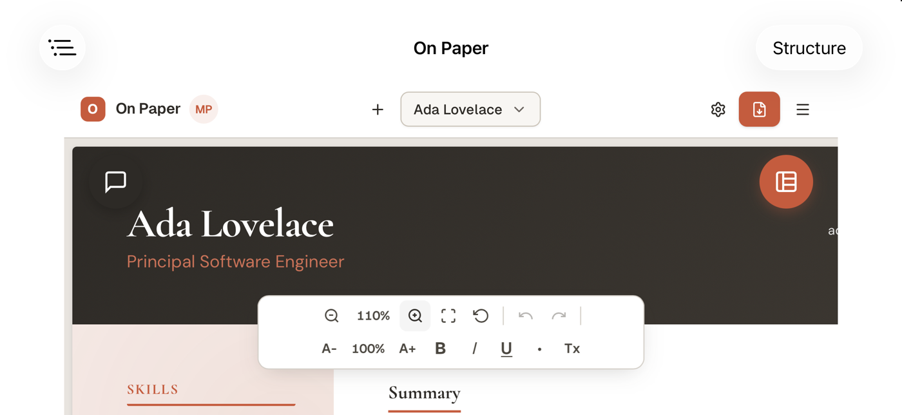

# SwiftUI lifecycle spike — can a native shell host Tauri's WKWebView?

**Date:** 2026-08-10 · **Branch:** `feat/ios-phase-0` · **Status:** answered

Follows the blocker recorded in
[`swiftui-hybrid-brainstorm-notes.md`](swiftui-hybrid-brainstorm-notes.md)
("BLOCKER found executing step 1 — the spec's premise is wrong"), which framed
three ways forward: **A** (tao keeps the lifecycle, SwiftUI is injected), **B**
(Swift owns the lifecycle), **C** (native app, Tauri desktop-only). This spike
evaluated A ("reparent") and B ("invert"), in that order.

---

## VERDICT

| Route | Verdict |
|---|---|
| **Route 1 — reparent (A)** | **WORKS.** Verified running on an iOS 26.5 simulator: real SwiftUI `NavigationStack` chrome, native toolbar and a `UISheetPresentationController` sheet with detents, hosting wry's live `WKWebView`, with Tauri IPC still functioning. |
| **Route 2 — invert (B)** | **NOT VIABLE as specified**, on hard evidence, not judgement — see [Route 2](#route-2--invert-not-viable-as-specified). tao asserts that no `UIApplication` exists yet when its event loop starts; a Swift `@main App` violates that by construction. |

**Recommendation: take Route 1.** Cost is stated in full [below](#recommendation-and-honest-cost).

---

## What "works" actually looks like

Everything below is the same binary, built by the normal
`npx tauri ios build --debug --target aarch64-sim` path and installed with
`xcrun simctl install`.

**Before** — today's shipped iOS UI. The résumé renders, but every piece of
chrome is web: the app's own header bar, the floating chat/structure buttons,
the zoom toolbar. There is no native anything.



**After** — the same webview, same document, same app, now hosted inside a
SwiftUI `NavigationStack`. The top bar ("On Paper" title, the leading SF Symbol
button, the trailing "Structure" button) is native SwiftUI; everything below it
is the unchanged wry `WKWebView`. The web header is still there because this
spike deliberately did not touch web code — the point is that native chrome now
sits *above* it in a real UIKit hierarchy.



**A real sheet, not a web modal** — `.sheet` + `.presentationDetents([.medium, .large])`.
This is a genuine `UISheetPresentationController`: system material, drag
indicator, medium detent, the webview dimmed behind it. It only exists if a real
UIKit presentation chain owns the screen.



**The webview is still live and Tauri IPC still works** — tapping the web zoom
"+" *after* the reparent moved the document to 110% and wrote through
`storage_write` to the Rust disk store (see [IPC proof](#ipc-proof)).



**Rotation survives** — the SwiftUI bar adapts and the webview re-lays-out to
landscape width, even though tao's own view controller is no longer the root.



---

## Route 1 — reparent (WORKS)

### The idea

Keep `ffi::start_app()`. Let tao own `UIApplicationMain`, the run loop, the
`UIWindow` and the webview, exactly as today. Then, once the window is
scene-attached, reach into UIKit from Rust — the pattern
`src-tauri/src/ios_view.rs` already established — and:

1. instantiate a `UIHostingController` wrapping a SwiftUI view,
2. make it the window's `rootViewController`,
3. move the existing `WKWebView` into a container inside that SwiftUI hierarchy.

The SwiftUI itself is written as real Swift in the Xcode project and exposed
through one `@objc` class, so Rust only has to *instantiate* it — it never
constructs SwiftUI.

### What was built

| File | Tracked? | Role |
|---|---|---|
| `resume-designer/src-tauri/ios/OPSpikeShell.swift` | yes | The SwiftUI shell + the single `@objc` entry point. |
| `resume-designer/src-tauri/src/ios_shell.rs` | yes | Calls into it from the Tauri run loop. |
| `resume-designer/src-tauri/src/lib.rs` | yes | Two lines wiring `ios_shell::on_run_event` in after `ios_view::on_run_event`. |
| `src-tauri/gen/apple/Sources/resume-designer/OPSpikeShell.swift` | **no** (gen is gitignored) | Build-time copy of the Swift file. |

The Swift entry point is three statements:

```swift
@objc(OPSpikeShell)
final class OPSpikeShell: NSObject {
  @objc(installShellInWindow:webView:)
  static func installShell(window: UIWindow, webView: UIView) {
    let host = UIHostingController(rootView: SpikeShellView(webView: webView))
    window.rootViewController = host
    window.makeKeyAndVisible()
  }
}
```

and the webview is adopted, not recreated, by a `UIViewRepresentable` that takes
the existing instance:

```swift
webView.removeFromSuperview()
webView.translatesAutoresizingMaskIntoConstraints = false
container.addSubview(webView)
// …pinned to all four container edges
```

From Rust the whole call is:

```rust
let Some(class) = AnyClass::get(c"OPSpikeShell") else { /* … */ };
let _: () = msg_send![class, installShellInWindow: ui_window, webView: webview];
```

### Three things that were load-bearing

1. **Wait for the scene.** `ios_shell` polls `RunEvent::MainEventsCleared` and
   returns early while `[window windowScene]` is nil. Installing a
   `UIHostingController` before `ios_view.rs` has attached the `UIWindowScene`
   puts SwiftUI into a window UIKit never lays out, and everything sizes to
   zero — the blank-screen failure mode. `ios_shell::on_run_event` is therefore
   called *after* `ios_view::on_run_event` in `lib.rs`, and `ios_view.rs` is
   still doing its job. It was not made redundant and was not touched.
2. **Explicit ObjC names.** `@objc(OPSpikeShell)` and
   `@objc(installShellInWindow:webView:)`. Without them Swift mangles both the
   class symbol and the selector, and `AnyClass::get(c"OPSpikeShell")` returns
   `None`. (The `ios_shell.rs` code handles that case with a distinct log line
   precisely so it is never confused with a layout failure.)
3. **`translatesAutoresizingMaskIntoConstraints = false`.** `ios_view.rs` drives
   the webview by frame + autoresizing mask; inside SwiftUI it has to be Auto
   Layout's job instead. This is also why rotation still works.

### Evidence

Console output from the running app, showing the actual class identities —
a `UIHostingController` is the root, and its child is wry's own webview class:

```
$ xcrun simctl spawn booted log show --last 1m --style compact \
    --predicate 'process == "On Paper"' | grep -iE "ios_shell|OPSpikeShell"

2026-08-10 14:59:06.361 Df On Paper[27198:40f3eb] (Foundation) [OPSpikeShell] installed:
  root=UIHostingController<SpikeShellView>
  webview=wry::wkwebview::class::wry_web_view::WryWebView0.55.1
2026-08-10 14:59:06.361 Df On Paper[27198:40f3f1] [com.resumedesigner.app:app] [stderr]
  [ios_shell] SwiftUI shell installed
```

<a id="ipc-proof"></a>
**IPC proof.** Before tapping the web zoom control there was no zoom key on
disk; after tapping it (post-reparent) `storage_write` had landed a new file:

```
$ ls "$(xcrun simctl get_app_container booted com.resumedesigner.app data)/Library/Application Support/com.resumedesigner.app/storage"
# BEFORE:  (no resume-zoom key)
# AFTER:   resume-p--pmsnrk3uso3hm3pp8kjg8--resume-zoom
$ cat .../resume-p--pmsnrk3uso3hm3pp8kjg8--resume-zoom
1.1
```

The value also survived a terminate/relaunch, so `storage_load_all` reads back
through the same path. Commands, IPC and the Rust disk store are all intact.

**Build.** The final verification used the packaged bundle, not DerivedData:

```
$ cd resume-designer && npx tauri ios build --debug --target aarch64-sim
…
    Finished 1 iOS Bundle at:
        …/src-tauri/gen/apple/build/arm64-sim/On Paper.app
$ xcrun simctl install booted ".../build/arm64-sim/On Paper.app"
$ xcrun simctl launch booted com.resumedesigner.app
com.resumedesigner.app: 27198
```

### Snags hit (all resolved — worth knowing before repeating this)

- **`xcodegen generate` adds `libapp.a` to the Resources phase.** `project.yml`
  globs `- path: Externals`, which was empty when Tauri first generated the
  project and is not empty afterwards. Regenerating then copies the 365 MB
  static library into the app bundle. Fix used here: move `Externals` aside,
  run `xcodegen generate`, move it back. A permanent fix would need an
  `excludes:` in `project.yml`.
- **`xcodegen generate` drops `DEVELOPMENT_TEAM = "847VH25R7U"`**, which Tauri
  injects into the pbxproj but does not record in `project.yml`. Irrelevant for
  simulator builds; it *will* matter for device builds.
- **`failed to rename app …: Directory not empty (os error 66)`** during Tauri's
  post-build packaging is a **stale-output-directory** problem, not a
  project-file problem. `rm -rf src-tauri/gen/apple/build/arm64-sim` before
  rebuilding and it succeeds. (Chased this as a suspected regression from the
  regeneration; it is not — the clean rebuild above proves it.)
- Xcode 26 builds the app as a 56 KB stub plus `On Paper.debug.dylib`; the Swift
  symbols live in the dylib, so `nm "On Paper"` looks empty and is misleading.
  Check `nm "On Paper.app/On Paper.debug.dylib" | grep OPSpikeShell`.

### Reproducing

```bash
cp resume-designer/src-tauri/ios/OPSpikeShell.swift \
   resume-designer/src-tauri/gen/apple/Sources/resume-designer/
cd resume-designer/src-tauri/gen/apple
mv Externals /tmp/ext && mkdir Externals && xcodegen generate && rm -rf Externals && mv /tmp/ext Externals
rm -rf build/arm64-sim
cd ../../.. && npx tauri ios build --debug --target aarch64-sim
xcrun simctl install booted "src-tauri/gen/apple/build/arm64-sim/On Paper.app"
xcrun simctl launch booted com.resumedesigner.app
```

`OP_SPIKE_SHELL=0` in the environment disables the shell and gives the
unmodified web UI, as an A/B control.

---

## Route 2 — invert (NOT viable as specified)

Route 1 succeeded, so Route 2 was evaluated on the source rather than built. The
answer is decisive and does not depend on judgement.

### What `start_app` actually is

`start_app` is **not** a Tauri library function — it is generated into *our own*
crate by `#[cfg_attr(mobile, tauri::mobile_entry_point)]` on `run()` in
`src-tauri/src/lib.rs`. The macro
(`tauri-macros-2.6.3/src/mobile.rs`, `entry_point`) emits:

```rust
// be careful when renaming this, the `start_app` symbol is checked by the CLI
#[cfg(not(target_os = "android"))]
#[no_mangle]
#[inline(never)]
pub extern "C" fn start_app() { _start_app() }
```

where `_start_app()` calls `tauri::log_stdout()` and then our `run()` inside a
`catch_unwind`. So `main.mm`'s `ffi::start_app()` is a thin C shim onto our
`run()`; it carries no hidden iOS bootstrapping of its own.

### Why Swift cannot own `@main` and still keep Tauri

The lifecycle ownership lives one layer down, in tao. `EventLoop::run`
(`tao-0.35.3/src/platform_impl/ios/event_loop.rs:141-166`) starts with:

```rust
let application: id = msg_send![class!(UIApplication), sharedApplication];
assert_eq!(
  application,
  ptr::null_mut(),
  "`EventLoop` cannot be `run` after a call to `UIApplicationMain` on iOS\n\
   Note: `EventLoop::run` calls `UIApplicationMain` on iOS"
);
…
UIApplicationMain(0, ptr::null(), nil, NSStringRust::alloc(nil).init_str("AppDelegate"));
unreachable!()
```

Three consequences, in order of finality:

1. **tao requires that no `UIApplication` exists yet.** A Swift `@main App`
   *is* `UIApplicationMain`. By the time any Swift lifecycle code runs,
   `sharedApplication` is non-nil, and this assertion fires. The failure is a
   panic at launch, not a degraded mode.
2. **tao installs its own app delegate** (`"AppDelegate"`, its class), so it
   intends to *be* the application, not to attach to one.
3. **`run` returns `!`.** There is no "start Tauri and return to Swift".

And Tauri's iOS IPC is not separable from that: commands, `invoke_handler`, the
plugin runtime and `WebviewWindow` all hang off the `App` produced by
`builder.build(...).run(...)` — which is what calls `EventLoop::run`. Skip
`start_app()` and there is no `AppHandle` at all, so "run Tauri's IPC without
its windowing" has nothing left to run.

Route 2 could only be reached by forking tao (and probably
`tauri-runtime-wry`) so the event loop attaches to an already-running
`UIApplication` instead of creating one. That is an upstream fork carried
forever, for a result Route 1 already delivers. Not recommended.

Note that this also collapses the distinction between B and C: if Swift owns
`@main`, Tauri is gone on iOS, and storage/commands must be reimplemented in
Swift — which is option C, and it contradicts decision 3 of the brainstorm
notes ("the JS store stays source of truth").

---

## Recommendation and honest cost

**Take Route 1.** It is the only one of the three that keeps Tauri whole, and it
is demonstrably sufficient: `NavigationStack`, native toolbar, and real sheets
with detents all work, over the live webview, with IPC intact.

The brainstorm notes called route A "least native of the three" and predicted
"the shell is assembled from Rust through objc2" and "SwiftUI never owns
navigation". **Both predictions turned out to be wrong**, and that is the main
thing this spike changes:

- The Rust side is one `msg_send!` and a guard. All composition is ordinary
  Swift in the Xcode project. Nothing about the shell is written through objc2.
- Because the `UIHostingController` becomes the window's `rootViewController`,
  SwiftUI **does** own navigation, safe areas, presentation and rotation. The
  webview is a leaf in its layout, not a sibling that has to be hand-positioned.

### What it costs

- **`gen/apple` becomes tracked source.** Decision 4 of the brainstorm notes
  stands, unchanged: un-ignore `src-tauri/gen/apple` (`resume-designer/.gitignore:10`)
  or the Swift file and the pbxproj entry vanish on the next `tauri ios init`.
  A generated project becomes a maintained one, and Tauri upgrades bring
  conflicts we own. Two gotchas found here belong in that decision: the
  `Externals`/`libapp.a` glob and the dropped `DEVELOPMENT_TEAM`.
- **A hard ordering dependency on `ios_view.rs`.** The shell may only be
  installed after the `UIWindowScene` is attached. `ios_view.rs` is now
  *more* load-bearing than before, not less — its eventual deletion (when tao
  fixes the scene bug upstream) has to keep some equivalent readiness gate.
- **tao's view controller is detached.** Rotation and layout were verified to
  survive, because Auto Layout inside the hosting controller replaces what tao's
  controller used to do. Not yet exercised: keyboard avoidance, split view /
  Stage Manager on iPad, and whether tao still receives the window-resize events
  some of its own code expects. These need checking before shipping.
- **The standing cost the notes already name is unchanged**: every piece of
  chrome exists twice, SwiftUI on iOS and React on desktop. This spike says
  nothing about that trade — it only says the technical premise is sound.
- **This spike is not a design.** It proves the seam. The web shell is still
  fully present underneath (see screenshot 05); hiding it, and deciding what
  native chrome replaces it, is the actual project.

### Not settled by this spike

The structure-panel bridge (decisions 5 and 6 of the brainstorm notes, and its
three named risks — echo-while-typing, snapshot granularity, path-grammar
drift) is untouched here. Route 1 makes it possible; it does not make it easy.

---

## Scope discipline

- No web code (`resume-designer/src/**`, `styles/**`) was modified.
- `ios_view.rs` was not modified or deleted.
- Bundle id `com.resumedesigner.app`, the Cargo package name and every
  `resume-designer-*` storage key are untouched.
- The only repo changes are the two new spike files, two wiring lines in
  `lib.rs`, and this document with its screenshots.
- A résumé was seeded directly into the **simulator's** storage container to get
  past the AI-gated onboarding wizard. That is simulator state, not repo state.
